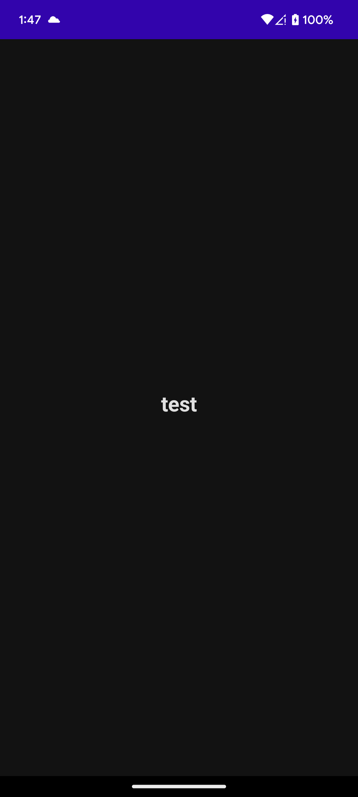
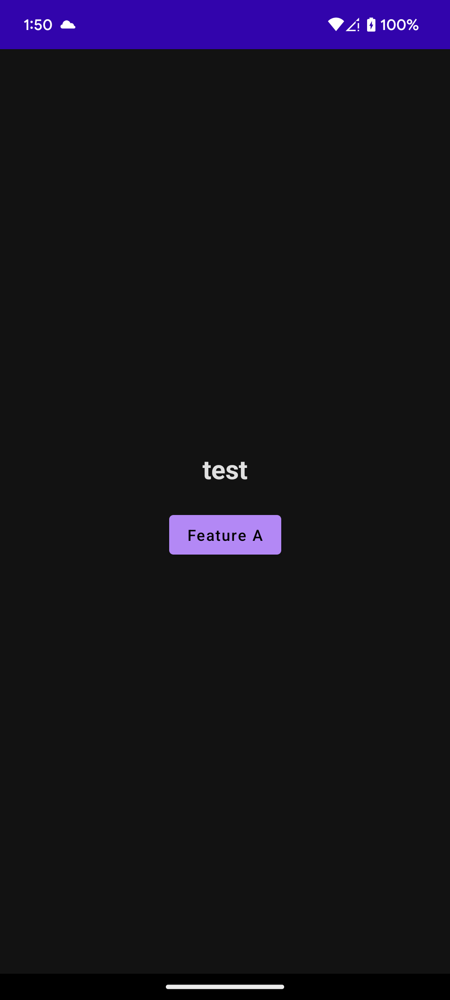

# `RemoteConfigDemo`

원격 설정 데모.

## TODO

1. 빌드 없이 앱 작동을 제어할 수 있는 설정 제공하기.
2. 동시에 여러 빌드에 서로 다른 설정 제공하기.
3. 무차별 대입 공격 방어하기.

## NOT TODO

1. 사용자별 권한 제어.
2. 설정 암호화.

## 개발환경

1. Firebase 프로젝트 생성.
    - [https://console.firebase.google.com/project/remoteconfigdemo-f957c/overview]
2. [Firebase CLI](https://firebase.google.com/docs/cli) 설치.
    - Homebrew : `brew install firebase-cli`
3. `cd firebase`
4. `firebase login` : CLI 인증.
5. `firebase init`
    - Hosting만 사용 설정.
6. `firebase deploy --only hosting`
    - [https://remoteconfigdemo-f957c.web.app]에 접속해서 확인.

## 테스트

1. Firebase 파일을 배포 한다.
2. 앱을 실행한다. `Feature A` 버튼이 보이지 않는다.
   
3. [`0.0.1-1.json`](firebase/hosting/config/0.0.1-1.json)의 `.payload.featureA`를 `true`로 변경한다.
4. Firebase 파일을 배포 한다.
5. 앱을 재실행한다. `Feature A` 버튼이 보인다.
   
